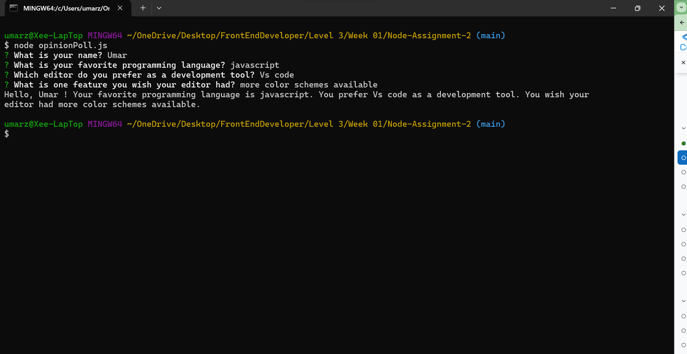

# Node-Assignment-2
## Objective
- Demonstrate your understanding of the Inquirer package by creating a simple command-line application that gathers user opinions through interactive prompts. This application should ask the user a series of questions about their preferences on various topics, showcasing your ability to handle user input in Node.js.

## Step 1: Initialize Your GitHub Repository
- Created a New GitHub Repository and named it Node-Assignment-2.
- Initialized it with a README file.

## Step 2: Clone the Repository

- Use the git clone command followed by the URL of your new repository to clone it to your local machine.
Project Setup:

- Navigated to your project directory (cd Node-Assignment-2) and run npm init -y to initialize a new Node.js project.

## Step 3: Install Inquirer:

- Run "npm install inquirer" to install the Inquirer package, which will be used to create the interactive prompts.

## Step 4: Create the Opinion Poll

- In the root of project directory, created a file named opinionPoll.js.

- Implemented a series of prompts using Inquirer to ask the user for their input. The questions include:

### A personalization question: 
- "What is your name?" (input type)
### An opinion question on programming languages:
- "What's your favorite programming language?" (list type with options like "JavaScript", "Python", "Ruby", "Other")
### A question about preferred development tool:
- "Which editor do you prefer?" (list type with options like "VS Code", "Sublime Text", "Atom", "Other")
### An open-ended opinion question:
- "What's one feature you wish your editor had?" (input type)
## Step 5: Logged User Responses to display in terminal window

- After the user answers all questions, used console.log to display a summary of their responses, enhancing the interactive experience.

### Screenshot of the terminal showing results

